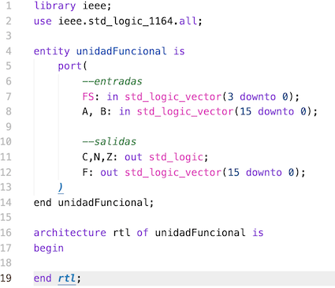
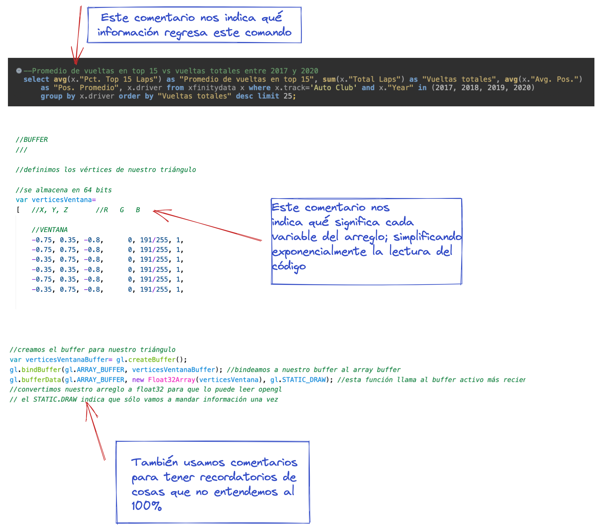

# Guía para la elaboración de un documento README

Así que has decidido unirte a *Hello Mexicoders!* Probablemente tendrás muchas dudas respecto al mundo del software; en esta sección, nos enfocaremos en el tema de la **documentación**. 

## Qué es la documentación 

Cuando decimos que un código está documentado, nos referimos a que está acompañado de algun(os) documento(s) escritos con el fin de que el usuario entienda las funcionalidades del programa o sistema. Dependiendo del programa en cuestión, la documentación se puede presentar en distintos formatos, como: 

- archivos .md (markdown) tal y como este
- páginas web seccionadas 
- libros 
- series de video
- audiolibros
- comentarios dentro del código 

### Ejemplo de documentación (Matlab)

## ¿Por qué documentamos?

Cuando estamos en el rol de programadores, tendemos a pensar de manera distinta a la cotidiana. Por ende, nos podemos disociar de nuestros usuarios y asumir que las cosas que son sencillas para nosotros, también lo serán para ellos. El primer motivo para documentar es permitir al usuario entender al código con igual profundidad que quien lo escribió; de esta forma, se puede dar la colaboración y el mejoramiento continuo de los programas. 

Otro motivo importante para documentar, como se señala en el artículo *A beginner’s guide to writing documentation*, es que "el código que escribiste hace 6 meses será tan irreconocible como el que escribió otra persona" (Holscher, Eric). Una vez que el código no esté "fresco" en nuestra mente, nos será tan difícil entenderlo como a los usuarios externos. Es necesario generar la documentación adecuada para que esto no ocurra. 

### Ejemplo de un código no-documentado 

¡No se hagan! Nadie le entendió a la primera debido a que no existe una documentación (ni si quiera en forma de comentarios) que nos indique qué función realiza el circuito aquí descrito. 

## Cómo documentamos 

Al comenzar el proceso de documentación, hay que tener muy presente *para quién* estamos escribiendo. Es muy diferente documentar para un usuario promedio que para un desarrollador. Trataremos las diferencias a continuación: 

### Documentar para usuarios finales 

- Buscamos describir las funcionalidades generales del código y los problemas que soluciona. 
- Brindar instrucciones de instalación/ejecución. 
- No es necesario dar detalles del funcionamiento del código, pues es información poco relevante. 
- Es buena idea incorporar ejemplos de problemas similares en los que se ha aplicado el programa con éxito. (Holscher, Eric) 
- Incluir una sección de FAQ (preguntas comunes) para evitar al usuario tener que leer más de lo necesario. 

### Documentar para desarrolladores 

- Buscamos incluir la mayor cantidad de detalle posible sobre la estructura y funcionamiento del código. 
- Es recomendable ofrecer foros para que los desarrolladores puedan colaborar al código/programa. 
- No es necesario dar instrucciones sobre como instalar/ejecutar el programa. 
- Los comentarios dentro del código dan mayor claridad a los usuarios más conocedores en temas de programación. 
- Se tratan temas más técnicos y se evitan discusiones del uso general del código. 

### Ejemplo de documentación dentro del código

## Conclusiones 

- Siempre documenta tus proyectos. 
- Ten en cuenta tu audiencia y sus conocimientos técnicos.
- Otórgate las mejores posibilidades de entender tu código en un futuro. 
- Comenta tu código conforme lo escribes. 
- Diviértete en *Hello Mexicoders!*

## Referencias 

Holscher, Eric. “Writing Docs: a Beginner's Guide to Writing Documentation.” PDX Python. PDX Python, 29 Mar. 2022. 