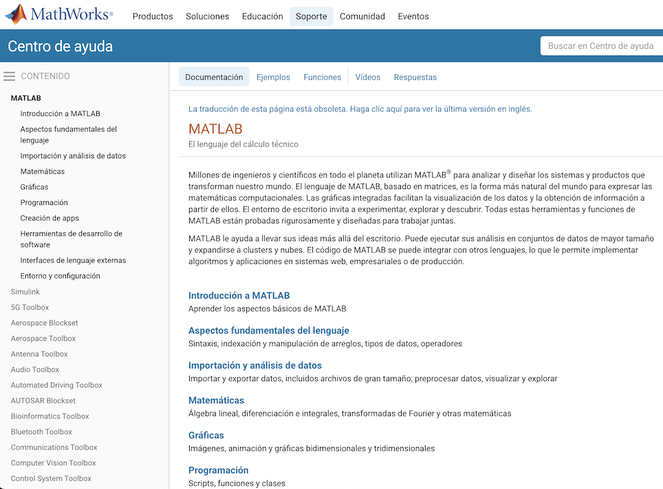

# Guía para la elaboración de un documento README

Así que has decidido unirte a *Hello Mexicoders!* Probablemente tendrás muchas dudas respecto al mundo del software; en esta sección, nos enfocaremos en el tema de la **documentación**. 

## Qué es la documentación 

Cuando decimos que un código está documentado, nos referimos a que está acompañado de algun(os) documento(s) escritos con el fin de que el usuario entienda las funcionalidades del programa o sistema. Dependiendo del programa en cuestión, la documentación se puede presentar en distintos formatos, por ejemplo: 

- archivos .md (markdown) tal y como este
- páginas web seccionadas 
- libros 
- series de video
- audiolibros
- comentarios dentro del código 

### Ejemplo de documentación (Matlab)

